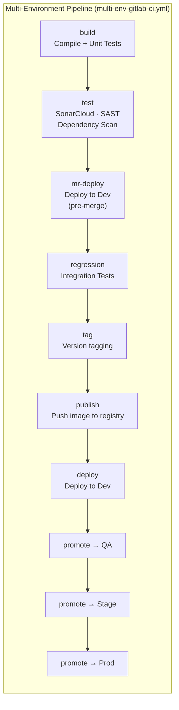
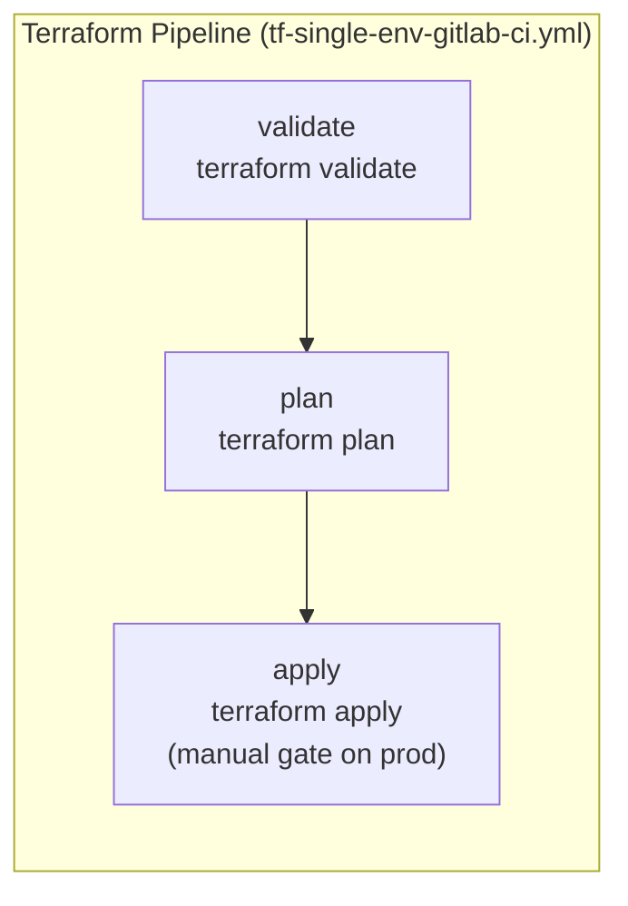

# GitLab CI/CD Pipeline Examples

Pipeline examples for single-environment and multi-environment GitLab CI/CD workflows, Terraform automation, and reusable delivery patterns.

## Architecture

## Available Pipelines

| File | Description |
|------|-------------|
| `multi-env-gitlab-ci.yml` | Full multi-stage pipeline: build, test, security scans, versioning, publish, and environment promotion (dev → QA → stage → prod) |
| `tf-single-env-gitlab-ci.yml` | Terraform single-environment pipeline: validate, plan, and apply with manual gate |
| `tf-complete-gitlab-ci.yml` | Complete Terraform workflow with multi-environment support and state management |
| `multi-build-gitlab-ci.yml` | Parallel build pipeline for monorepos or multi-service deployments |

## Key Features

- **Docker-in-Docker** — container operations within CI jobs
- **SonarCloud** — code quality analysis via shared pipeline library
- **Security scanning** — SAST, dependency scanning, license scanning, and secret detection (GitLab built-in templates)
- **Version and tag management** — automated versioning tied to branches and merge requests
- **Environment promotion** — controlled progression from dev through production with manual approval gates
- **Reusable includes** — shared pipeline library integration via `include:` blocks

## Usage

1. Copy the relevant `.yml` file to `.gitlab-ci.yml` in your repository
2. Adjust variables at the top of the file (image, project key, service name, etc.)
3. Configure required CI/CD variables in your GitLab project settings (AWS credentials, Sonar token, registry credentials)
4. Commit and push to trigger the pipeline
